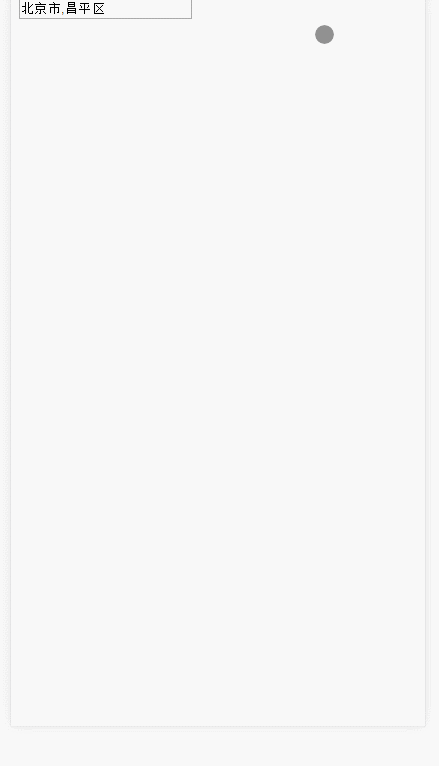

Mobile-Tree-Area
================

手机上的地区控件，树控件

**效果图**



使用 步骤：
------

**1.引入文件**

```
<link rel="stylesheet" href="plugin/Mobile-Tree-Area.css">
<script src="plugin/Mobile-Tree-Area.js"></script>
```

**2.创建容器：**

```
<input type="text" id="name" readonly>
<input type="hidden" id="id" readonly>
```
上面的用来展示你选中的内容，下面的用来承载选中内容的ID

**3.生成实例**	

```
new Location({
	id:"id",//存放选中内容的ID的容器的id，可不填
    name:"name",//展示选中内容的id
    tree:3,//你想让用户选到几层，可不填，不填默认为3
    data:LAreaData//初始化数据格式为：[{id:1,name:2,child[{id:1,name:2}]},....]
});
```


**github下载地址：**
[https://github.com/mrxu0/Mobile-Tree-Area/tree/master](https://github.com/mrxu0/Mobile-Tree-Area/tree/master)
